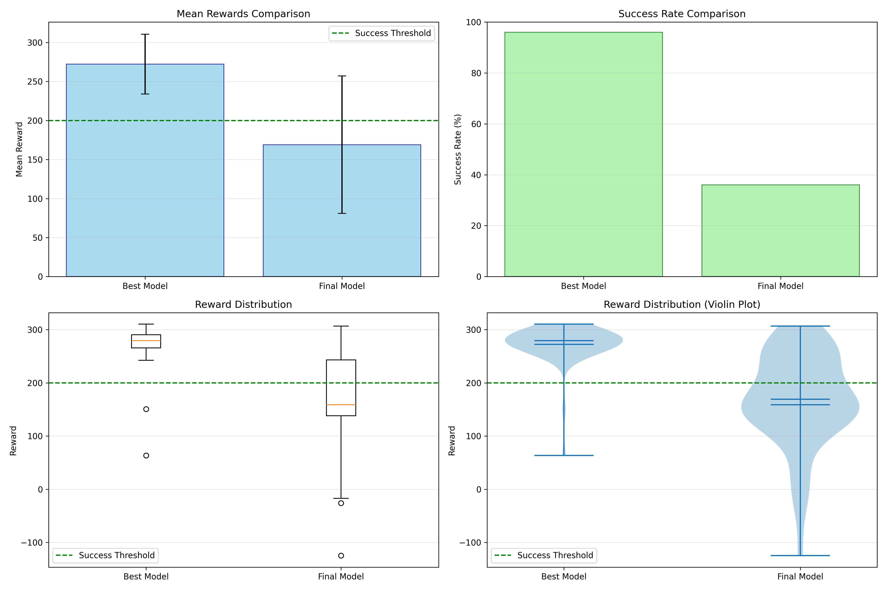
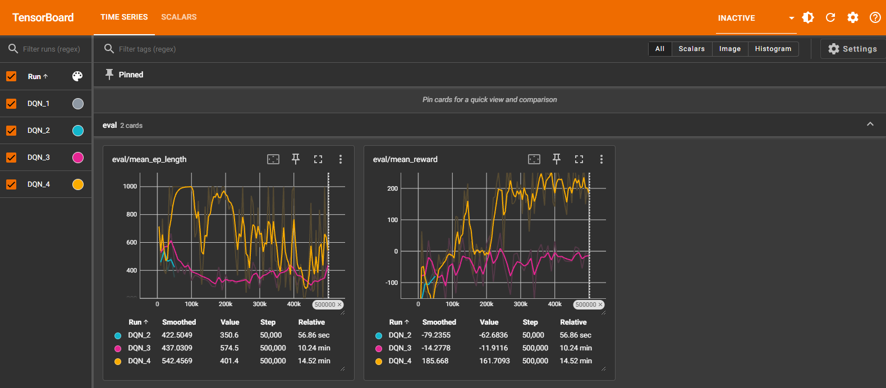

# Reinforcement Learning Agent for Lunar Lander

A Deep Q-Network (DQN) agent trained to autonomously land a lunar module using the OpenAI Gymnasium environment. The agent learns optimal landing strategies through trial-and-error interaction with the environment.


## Demo

### Before Training (50k steps) - Crashes
[Watch Video](assets/before.mp4)

### After Training (500k steps) - Successful Landings
[Watch Video](assets/after.gif)

## Results

### Performance Metrics

| Metric | Value |
|--------|-------|
| Mean Reward | 270.89 |
| Standard Deviation | 35.24 |
| Success Rate | 96% |
| Best Episode Reward | ~320 |
| Training Time | ~15 minutes (500k steps) |

### Model Comparison



| Model | Mean Reward | Success Rate |
|-------|-------------|--------------|
| Best Model | 270.89 ± 35.24 | 96.0% |
| Final Model | 174.37 ± 63.46 | 24.0% |

### Training Progress

The training curves show the agent's learning progression over 500,000 timesteps:



Key observations:
- Mean reward increases from negative values to 200+ (success threshold)
- Exploration rate decreases from 1.0 to 0.01 during training
- Training loss stabilizes as the agent converges

## Environment

**LunarLander-v3** from OpenAI Gymnasium:
- **State Space**: 8-dimensional continuous (position, velocity, angle, angular velocity, leg contact)
- **Action Space**: 4 discrete actions (do nothing, fire left engine, fire main engine, fire right engine)
- **Success Criteria**: Total episode reward ≥ 200

### Reward Structure
- Landing between flags: +100 to +140
- Each leg contact: +10
- Crash: -100
- Main engine firing: -0.3 per frame
- Side engine firing: -0.03 per frame

## Algorithm

Deep Q-Network (DQN) with the following features:
- Experience replay buffer for sample efficiency
- Target network for training stability
- Epsilon-greedy exploration strategy
- Neural network function approximation

### Hyperparameters

| Parameter | Value |
|-----------|-------|
| Learning Rate | 0.0005 |
| Batch Size | 128 |
| Buffer Size | 50,000 |
| Gamma (Discount) | 0.99 |
| Target Update Interval | 250 steps |
| Exploration Fraction | 0.2 |
| Final Epsilon | 0.01 |
| Network Architecture | [256, 256] |

## Installation

```bash
# Clone the repository
git clone https://github.com/YOUR_USERNAME/RL_Agent_Openai_gym.git
cd RL_Agent_Openai_gym

# Create virtual environment
python -m venv venv
.\venv\Scripts\Activate.ps1  # Windows
source venv/bin/activate     # Linux/Mac

# Install dependencies
pip install -r requirements.txt
```

## Usage

### Quick Start Menu
```bash
python quick_start.py
```

### Train Agent
```bash
python train.py
```

### Evaluate Agent
```bash
python evaluate.py
```

### Visualize Agent
```bash
python visualize.py
```

### Compare Models
```bash
python compare_models.py
```

### Monitor Training
```bash
tensorboard --logdir=./tensorboard_logs/
```

## Project Structure

```
├── train.py              # Training script
├── evaluate.py           # Evaluation script
├── visualize.py          # Visualization script
├── compare_models.py     # Model comparison
├── quick_start.py        # Interactive menu
├── config.py             # Hyperparameters
├── utils.py              # Utility functions
├── requirements.txt      # Dependencies
├── models/               # Saved models
├── results/              # Evaluation results
├── plots/                # Generated plots
└── tensorboard_logs/     # Training logs
```

## Dependencies

- gymnasium[box2d]
- stable-baselines3
- torch
- numpy
- matplotlib
- tensorboard

## References

- [Playing Atari with Deep Reinforcement Learning](https://arxiv.org/abs/1312.5602) - Mnih et al., 2013
- [Human-level control through deep reinforcement learning](https://www.nature.com/articles/nature14236) - Mnih et al., 2015
- [Stable-Baselines3 Documentation](https://stable-baselines3.readthedocs.io/)
- [Gymnasium Documentation](https://gymnasium.farama.org/)

## License

MIT License
